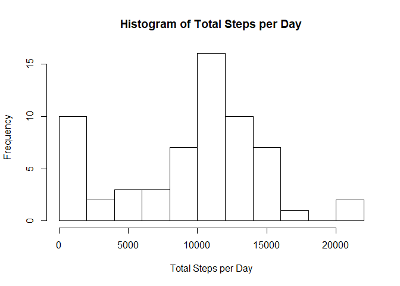
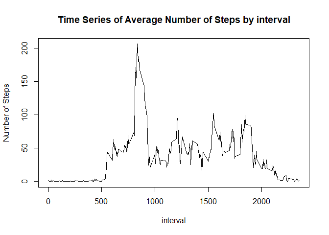
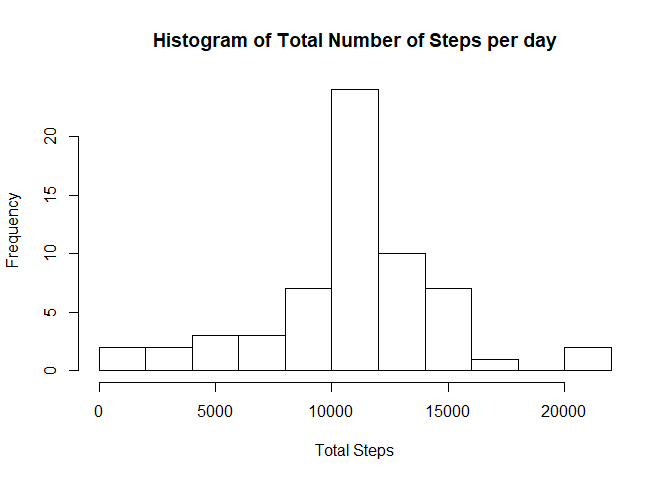
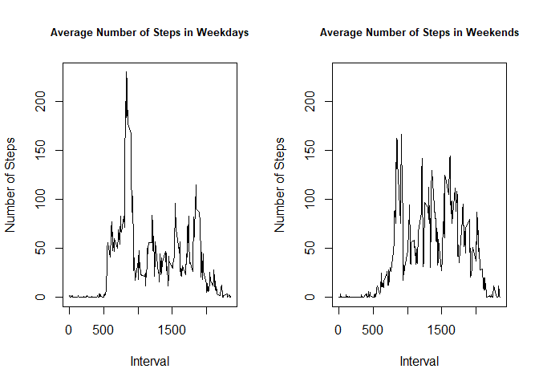

```r
knitr::opts_chunk$set(echo = TRUE)
```

## Loading and preprocessing the data


```r
setwd("C:/Users/me/Documents/Coursera/Reproducible Research/Project1/repdata_data_activity")
activity_data <- read.csv("activity.csv")
head(activity_data)
```

```
##   steps       date interval
## 1    NA 2012-10-01        0
## 2    NA 2012-10-01        5
## 3    NA 2012-10-01       10
## 4    NA 2012-10-01       15
## 5    NA 2012-10-01       20
## 6    NA 2012-10-01       25
```


```r
sapply(activity_data,class)
```

```
##     steps      date  interval 
## "integer"  "factor" "integer"
```

```r
activity_data$date <- as.Date(as.character(activity_data$date)) #convert factor to Date
```

## What is mean total number of steps taken per day?

1.Calculate the total number of steps taken per day

```r
TotalSteps <- tapply(activity_data$steps,activity_data$date,sum,na.rm=TRUE)
head(data.frame(TotalSteps))
```

```
##            TotalSteps
## 2012-10-01          0
## 2012-10-02        126
## 2012-10-03      11352
## 2012-10-04      12116
## 2012-10-05      13294
## 2012-10-06      15420
```
  

2.Make a histogram of the total number of steps taken each day

```r
hist(TotalSteps,10, xlab="Total Steps per Day",main="Histogram of Total Steps per Day")
```

<!-- -->
  
  3. Calculate and report the mean and median of the total number of steps taken per day

```r
MeanStepsPerDay <- mean(TotalSteps,na.rm=TRUE)
MeanStepsPerDay
```

```
## [1] 9354.23
```


```r
MedianStepsPerDay <- median(TotalSteps,na.rm=TRUE)
MedianStepsPerDay
```

```
## [1] 10395
```

## What is the average daily activity pattern?
1.Make a time series plot (i.e. type = "l"\color{red}{\verb|type = "l"|}type="l") of the 5-minute interval (x-axis) and the average number of steps taken, averaged across all days (y-axis)

```r
AvgSteps <- tapply(activity_data$steps,activity_data$interval,mean,na.rm=TRUE)
AvgSteps <- data.frame(interval=names(AvgSteps),Avg=AvgSteps)
plot(as.numeric(as.character(AvgSteps$interval)),AvgSteps$Avg,type="l",xlab="interval",ylab="Number of Steps",main="Time Series of Average Number of Steps by interval")
```

<!-- -->
  
2.Which 5-minute interval, on average across all the days in the dataset, contains the maximum number of steps?


```r
AvgSteps[AvgSteps$Avg==max(AvgSteps$Avg),]
```

```
##     interval      Avg
## 835      835 206.1698
```


## Imputing missing values

1.Calculate and report the total number of missing values in the dataset (i.e. the total number of rows with NA\color{red}{\verb|NA|}NAs)


```r
#calculate the total number of missing values
sum(is.na(activity_data$steps))
```

```
## [1] 2304
```
  
2.Devise a strategy for filling in all of the missing values in the dataset. The strategy does not need to be sophisticated. For example, you could use the mean/median for that day, or the mean for that 5-minute interval, etc.

3.Create a new dataset that is equal to the original dataset but with the missing data filled in.


```r
#fill missing value using mean for the 5-minute interval
activity_data2 <- merge(activity_data,AvgSteps, by="interval")
activity_data2$steps[is.na(activity_data2$steps)] = activity_data2$Avg[is.na(activity_data2$steps)]
sum(is.na(activity_data2$steps))
```

```
## [1] 0
```
  
4.Make a histogram of the total number of steps taken each day and Calculate and report the mean and median total number of steps taken per day. Do these values differ from the estimates from the first part of the assignment? What is the impact of imputing missing data on the estimates of the total daily number of steps?


```r
TotalSteps.rm.NA <- tapply(activity_data2$steps,activity_data2$date,sum)
hist(TotalSteps.rm.NA,10,xlab="Total Steps",main="Histogram of Total Number of Steps per day")
```

<!-- -->


```r
MeanStepsPerDay.rm.NA <- mean(TotalSteps.rm.NA)
MeanStepsPerDay.rm.NA
```

```
## [1] 10766.19
```

```r
MedianStepsPerDay.rm.NA <- median(TotalSteps.rm.NA)
MedianStepsPerDay.rm.NA
```

```
## [1] 10766.19
```


## Are there differences in activity patterns between weekdays and weekends?


1. Create a new factor variable in the dataset with two levels - "weekday" and "weekend" indicating whether a given date is a weekday or weekend day.

```r
activity_data2$weekdays <- weekdays(activity_data2$date)
activity_data2$weektype[activity_data2$weekdays %in% c("Saturday","Sunday")]<-"Weekends"
activity_data2$weektype[is.na(activity_data2$weektype)]<-"Weekdays"
head(activity_data2)
```

```
##   interval    steps       date      Avg weekdays weektype
## 1        0 1.716981 2012-10-01 1.716981   Monday Weekdays
## 2        0 0.000000 2012-11-23 1.716981   Friday Weekdays
## 3        0 0.000000 2012-10-28 1.716981   Sunday Weekends
## 4        0 0.000000 2012-11-06 1.716981  Tuesday Weekdays
## 5        0 0.000000 2012-11-24 1.716981 Saturday Weekends
## 6        0 0.000000 2012-11-15 1.716981 Thursday Weekdays
```
  
2.Make a panel plot containing a time series plot (i.e. type = "l"\color{red}{\verb|type = "l"|}type="l") of the 5-minute interval (x-axis) and the average number of steps taken, averaged across all weekday days or weekend days (y-axis).


```r
AvgSteps <- aggregate(activity_data2$steps,list(interval = activity_data2$interval,weektype = activity_data2$weektype),mean)
AvgSteps.Weekdays <- AvgSteps[AvgSteps$weektype=="Weekdays",]
AvgSteps.Weekends <- AvgSteps[AvgSteps$weektype=="Weekends",]

par(mfrow=c(1,2))
rng <- range(AvgSteps$x)
plot(AvgSteps.Weekdays$interval,AvgSteps.Weekdays$x,type="l",ylim=rng, xlab="Interval",ylab="Number of Steps", main = "Average Number of Steps in Weekdays",cex.main=.8)
plot(AvgSteps.Weekends$interval,AvgSteps.Weekends$x,type="l",ylim=rng, xlab="Interval",ylab="Number of Steps",main = "Average Number of Steps in Weekends",cex.main=.8)
```

<!-- -->
